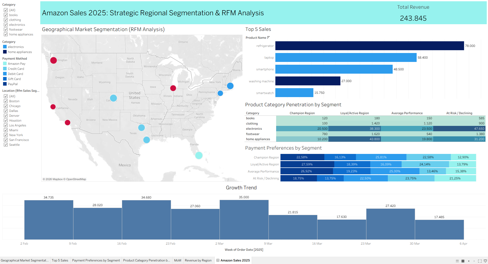

# Amazon Sales 2025: Strategic Regional Segmentation & RFM Analysis

## Project Overview
This project delivers an end-to-end data analysis solution for Amazon's 2025 sales performance. The core objective is to move beyond aggregate numbers and perform **Strategic Regional Segmentation**. By implementing the **RFM (Recency, Frequency, Monetary)** framework, geographical markets are categorized into distinct behavioral segments (e.g., Champions, Loyal, At-Risk) to facilitate data-driven marketing and operational decisions.

---
Dashboard Preview
Below is the final interactive dashboard highlighting key regional metrics, RFM segments, and temporal trends.

## Technical Methodology

### 1. Data Transformation & Enrichment (SQL)
The initial dataset required significant restructuring to ensure 100% geographical accuracy in Tableau:
* **Geographical Mapping**: Implemented a `CASE` statement to map specific cities (e.g., Miami, Seattle, Houston) to their respective **States** (Florida, Washington, Texas), resolving ambiguity for Tableau's map engine.
* **Data Cleaning**: Applied `TRIM`, `LOWER`, and `STR_TO_DATE` functions to standardize product names and order dates.
* **Type Casting**: Converted price and revenue fields to `DECIMAL(10,2)` to ensure precision during monetary aggregation.

### 2. Advanced Analytics & RFM Scoring
Developed a multi-stage SQL pipeline to calculate behavioral scores:
* **MoM Growth**: Utilized `LAG` to calculate Month-over-Month revenue growth percentages.
* **Hybrid RFM Scoring**:
    * **Recency (Absolute Thresholds)**: Used `CASE WHEN` to apply strict business rules. For example, regions with **0-day recency** are automatically awarded the maximum score (5), prioritizing immediate engagement over relative ranking.
    * **Frequency & Monetary (Relative Percentiles)**: Leveraged `NTILE(5)` window functions to dynamically distribute regions into performance quintiles. This ensures the scoring system remains robust and scalable regardless of total revenue fluctuations.
* **Final Segmentation**: Calculated a consolidated `rfm_avg_score` to categorize locations into labels such as **Champion Region**, **Loyal/Active**, and **At Risk**.

### 3. Interactive Visualization (Tableau)
* **Geographical Market Segmentation**: A map-driven interface displaying RFM labels by state and city.
* **Product Category Penetration**: A heatmap identifying which categories (e.g., Electronics, Home Appliances) drive revenue in specific segments.
* **Executive KPIs**: Real-time summary of **Total Revenue** and **Transaction Volume**.
* **Payment Preference Analysis**: Stacked bar charts correlating payment methods (Amazon Pay, Credit Card, etc.) with regional segments.
---

## Business Insights

### Market Dominance: Texas is the New Engine
* **Insight**: Contrary to common assumptions, **Texas** has emerged as the top-performing state with **$55.5K** in Total Sales, outperforming traditionally strong markets like California ($34K) and Florida ($31.7K).
* **Actionable Strategy**: Future marketing budgets should prioritize the Texas region (specifically Dallas & Houston) to capitalize on this established high-spending base.

### Retention Urgency
* **Insight**: Seattle (Washington) is a critical "High Value, High Risk" territory. Despite generating **$26.8K** in revenue (comparable to Loyal regions), its **Recency Score has dropped to 2**, indicating a dangerous period of inactivity.
* **Actionable Strategy**: Immediate deployment of "Win-Back" campaigns (e.g., targeted email offers) is required for Seattle customers to prevent churn of this high-value segment.

### Segment Strategy
* **Insight**: Although the **Champion Segment** (Miami) shows lower *Total Aggregate Revenue* compared to larger segments like "Loyal" or "At-Risk", this is purely due to population size. On a per-city basis, Champions exhibit the **highest efficiency**: perfect **0-day Recency** and peak **Frequency (31 orders)**, significantly outperforming the per-city average of other groups.
* **Actionable Strategy**: Use the Champion profile (High Frequency, Recent Interaction) as the "Golden Standard" model to train recommendation algorithms for up-leveling the "Loyal" segment.

### Operational Planning
* **Insight**: Weekly analysis exposes a drastic revenue dip in **mid-March (Week of March 16)**, hitting a low of **$17.6K** immediately following the early-month peak of $35K. This pattern strongly correlates with the monthly consumer **Paycheck Cycle**, where high-ticket spending (Electronics) is front-loaded at the start of the month, leading to "spending fatigue" by week 3.
* **Actionable Strategy**: Operations should schedule inventory replenishment during the mid-month lull (Week 3) to prepare for the end-of-month demand recovery. Marketing should launch "Mid-Month Savers" promotions to flatten this volatility curve.
